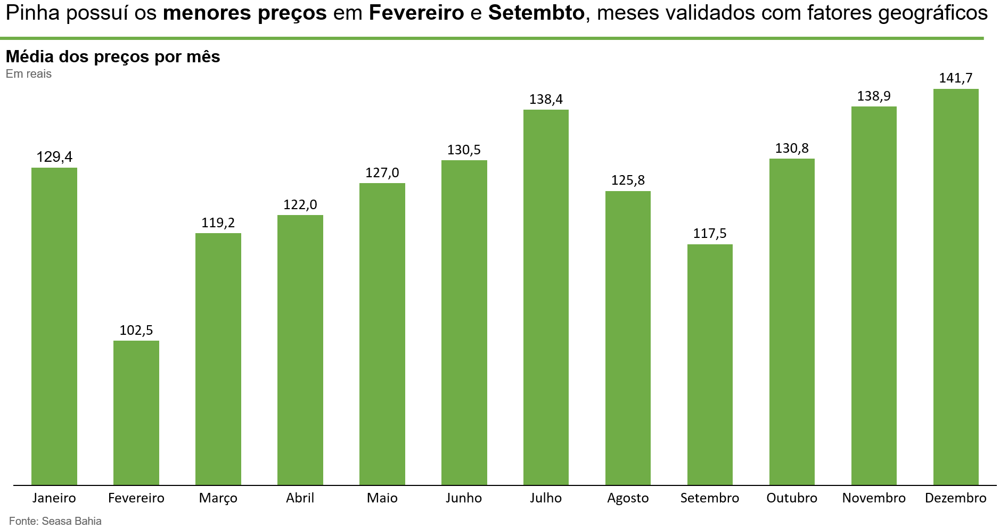
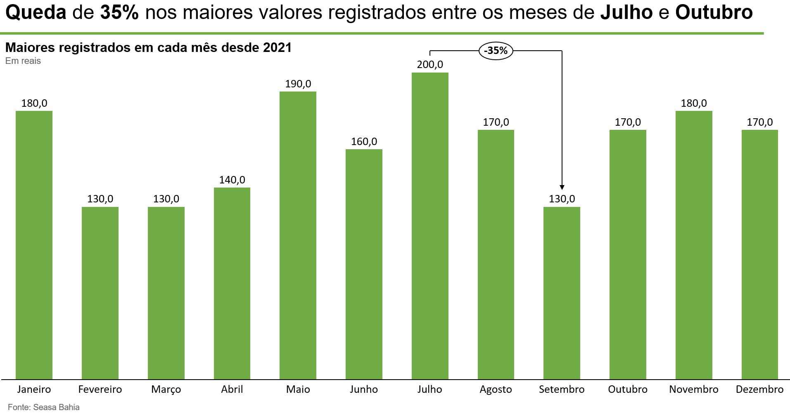
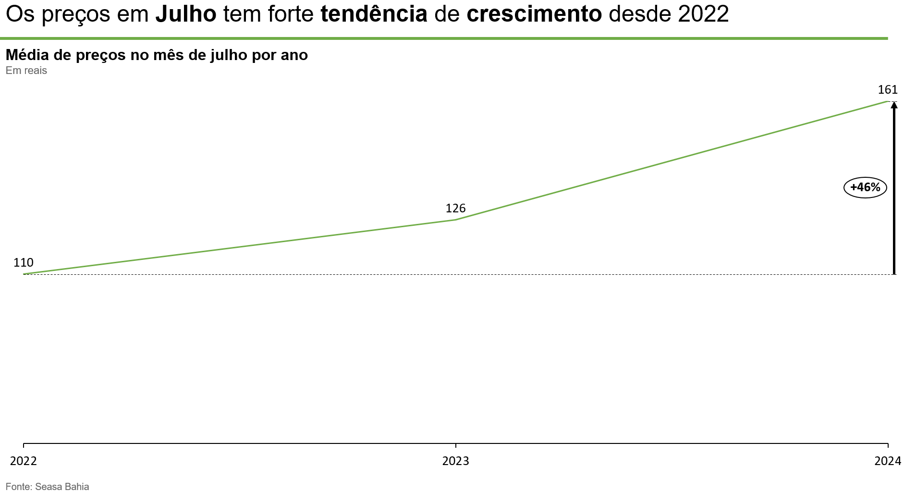

# Análise de Cotações da Pinha (Fruta do Conde)

## Overview
Este projeto envolve a coleta de dados sobre as cotações da pinha, também conhecida como fruta do conde em algumas regiões, no estado da Bahia, utilizando técnicas de web scraping. Os dados foram extraídos de PDFs disponibilizados pelo CEASA da Bahia, que é uma fonte importante de informações sobre o mercado agrícola regional. A Bahia, como maior produtor nacional dessa fruta, oferece uma perspectiva valiosa para entender as variações de preços ao longo do tempo. Essa coleta de dados servirá como base para análises futuras, que explorarão as tendências de mercado, os fatores que influenciam as cotações e o impacto econômico da produção de pinha na região.

## Fonte de Dados
Os dados foram coletados de boletins informativos disponibilizados pelo Governo do Estado da Bahia, a partir da CEASA, central de abastecimento.
Exemplo: http://www.sde.ba.gov.br/wp-content/uploads/2024/08/07.08.2024.pdf

## Coleta de Dados
Para coletar os dados, basta fazer a requisição pela URL e converter o conteúdo com a BytesIO, posteriormente, com a biblioteca pdfplumber é tratado o conteúdo.
Posteriormente, foi preciso perceber que os links dos documentos variam em relação as datas, portanto, é possível acessar todos os links apenas iterando e alterando as datas na URL, para isso, criei as funções:
```python
def get_pdf(pdf_url):
    try:
        response = requests.get(pdf_url)
        response.raise_for_status()  # Verificar se a requisição foi bem-sucedida
        pdf_file = BytesIO(response.content)
        
        texto = ''
    
        with pdfplumber.open(pdf_file) as pdf:

            for page_number, page in enumerate(pdf.pages):
                texto_novo = page.extract_text()
                texto = texto + texto_novo
                
        return texto
    except requests.exceptions.Timeout:
        print('A requisição demorou muito para responder.')
    except requests.exceptions.RequestException as e:
        print(f'Erro ao fazer a requisição: {e}')
    except Exception as e:
        print(f'Outro erro ocorreu: {e}')
```

```python

def new_pdf(date):
    if date.day > 9:
        if date.month > 9:
            return f'http://www.sde.ba.gov.br/wp-content/uploads/{date.year}/{date.month}/{date.day}.{date.month}.{date.year}.pdf'
        return f'http://www.sde.ba.gov.br/wp-content/uploads/{date.year}/0{date.month}/{date.day}.0{date.month}.{date.year}.pdf'
    
    if date.month > 9:
        return f'http://www.sde.ba.gov.br/wp-content/uploads/{date.year}/{date.month}/0{date.day}.{date.month}.{date.year}.pdf'
    
    return f'http://www.sde.ba.gov.br/wp-content/uploads/{date.year}/0{date.month}/0{date.day}.0{date.month}.{date.year}.pdf'

```
```python
def get_series(df, produto, data_final):
    series = {
        'Produto':produto,
        'Data':
        'Preco':
    }
    data_inicial = datetime.now()
    data_atual = data_inicial
    
    while data_atual > data_final:
        print(data_atual.strftime("%Y-%m-%d"))
        
        # Supondo que new_pdf e get_pdf são funções definidas em outro lugar
        texto = get_pdf(new_pdf(data_atual))
        
        # Verificar se texto não é None
        if texto is None or '404 Client Error' in texto:
            data_atual -= timedelta(days=1)
            continue
        
        # Supondo que linhas é uma lista de strings obtida do texto
        linhas = texto.split('\n')
        
        for linha in linhas:
            if produto in linha:
                series.append(linha)
        
        data_atual -= timedelta(days=1)
    
    return series
```

Por fim, criei o DataFrame foi criado a partir do dicionário.

```python
def dict_to_dataframe(data_dict):
    # Criar DataFrame a partir do dicionário
    df = pd.DataFrame(data_dict)
    
    return df
```

## Análise

A partir de uma breve exploração de dados, agrupei os preços por mês e calculei a média, obtendo essa distribuição:



Essa análise serve como uma validação dos dados coletados. É amplamente conhecido no interior da Bahia que fevereiro e março são os meses de alta produção do fruto. Esse fenômeno ocorre porque a maioria das chuvas se concentra no verão, em dezembro e janeiro. Os frutos resultantes dessas chuvas amadurecem nos meses seguintes, o que explica a queda nos preços devido ao aumento da oferta, em linha com as leis de oferta e demanda.

Além disso, é um questionamento sempre presente nas tomadas de decisões na setor agrícola é: plantar quando, para colher quando? Os prós e contras se encontram divididos em dois pontos focais, o período de maior valorização da commoditie geralmente apresenta maior risco de colheita, uma vez que o preço é menor porque a produção geral é maior devido as condições climáticas favoráveis. Tentar fugir desse período favorável à colheita é tentar ir contra a natureza. Porém, com a tecnologia adequada e planejamento tecnológico correto, é possível produzir o ano todo, porém, em menores quantidades. 

Então, muitos querem saber se o ganho em valorização das commodities em épocas de baixa são suficientes para compensar a baixa nas produções, para assim, plantar em épocas diferentes do mercado. Para tentar responder essa pergunta, podemos usar o gráfico anterior, mas acho esse mais interessante:



Caso o produtor consiga a melhor qualidade e acerte as janelas de venda que existem dentro do mês, e além disso, possua um forte poder de negociação na sua região, é extremamente válido se planejar para venedr em julho, já que, é muito difícil que sua produção caia mais que um terço. 

Porém, ainda pode existir uma dúvida: esse fênomeno de hípervalorização em julho não pode ser apenas um fator momentâneo e os preços caírem para as safras de 2025?



O gráfico acima torna explícito que é extremamente provável que essa tendência se mantenha para os próximos anos, caso siga os anos anteriores.

